# StarkWare

StarkEx 和 StarkNet 均为 StarkWare 团队开发的项目，前者类似 Iaas，类比应用链，StarkWare 帮助大型项目开发专有应用 Rollup；后者则是可部署通用应用的Rollup。

StarkWare 主要由世界顶级密码学家构成，

- Eli Ben-Sasson：Co-Founder & 首席科学家，以色列理工学院计算机专业的教授。Zcash 的创始科学家，ZK-STARK的发明者。
- Alessandro Chiesa：Co-Founder & 首席科学家，加利福尼亚大学伯克利分校计算机专业的教授。Zcash项目的co-founder，ZeroCash协议的co-investor，同时也是[libsnark](https://github.com/scipr-lab/libsnark)和[artworks](https://github.com/arkworks-rs)的核心开发者。
- Uri Kolodny：Co-Founder & CEO，Uri 是一个商业经验丰富、善于合作的连续创业者。
- Michael Riabzev：Co-Founder & 首席架构师。以色利理工学院的博士，曾在 Intel、IBM 工作。
- Oren Katz：工程副总裁。Hebrew大学计算机专业毕业，Tel Aviv MBA，20 年经验的资深工程师。
  - 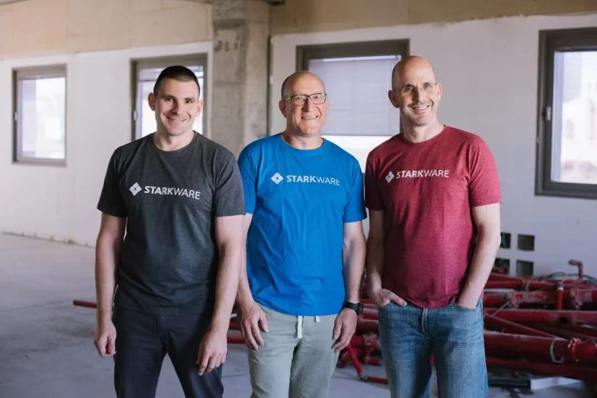


截止目前，StarkWare  （StarkNet 背后团队）已经完成 6 轮融资，共计 2.73 亿美元。尤其是最近一轮融资金额达到 1 亿美元，使其估值翻了两番，达到 80 亿，是所有 L2 项目中估值最高的。Vitalik 是种子轮投资者，此外，投资方名单中还包括 Paradigm  、红杉资本  、Tiger Global、Founders Fund 等多轮投资者。

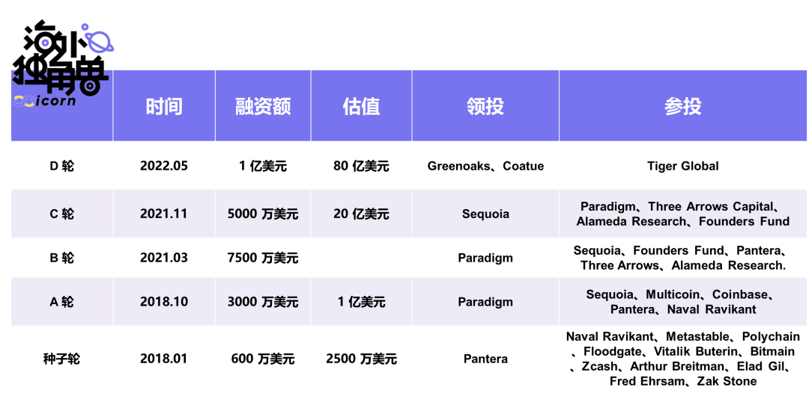

参考链接：https://mp.weixin.qq.com/s/VthPnsONmW8yywna0QzFQg

# 基本概念

## ZK-Rollup

**解决什么问题？-- 扩容**


在传统货币理论中存在“不可能三角”，即一国无法同时实现货币政策的独立性、汇率稳定与资本自由流动，最多只能同时满足两个目标，而放弃另外一个目标。

相类似，当前的区块链技术也存在“**不可能三角**”，即无法同时达到**可扩展（Scalability）**、**去中心化（Decentralization）**、**安全（Security）**，三者只能得其二。

- 可扩展性：每秒可以处理大量交易。
- 去中心化：拥有大量参与区块生产和验证交易的节点。
- 安全性：获得网络的多数控制权需要非常高昂的成本。

目前很多区块链会在三者中有所权衡，比如以太坊和比特币比较关心的就是去中心化和安全性。而有一些新公链更注重的是可扩展性和安全性。

从比特币创世开始，一直到以太坊网络中Crypto Kitties游戏的出现。主流公链项目最被人诟病的地方就是低下的TPS，以太坊当下的TPS完全无法给大多数应用提供实时稳定的支持，这与当前互联网行业动辄上万TPS的业务形成了鲜明的对比。

**扩容方案**

对于以太坊而言，过去几年内关于以太坊扩容的方案不断出现。其主流的方案如下所示:

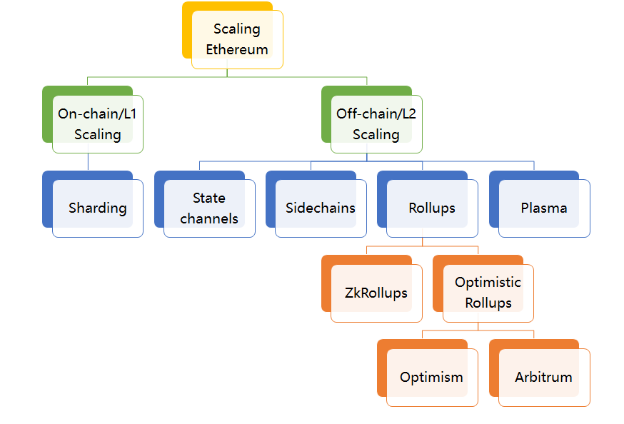

- 链上扩容：
  - 分片（Sharding）技术：Sharding一词本来源于数据库的术语，表示将大型数据库分割为很多更小的、更易管理的部分，从而能够实现更加高效的交互。区块链分片是指对区块链网络进行分片，从而增加其扩展性。根据最新的以太坊2.0规范，以太坊区块链会被分为1024个分片链，这也意味着以太坊的TPS将提高1000倍以上。但目前Sharding方案仍然在跨分片通信、欺诈识别、随机分配与选举安全性等方面存在不足。
- 链下扩容：
  - 状态通道（State Channel）：指用于执行交易和其他状态更新的“链下”技术。但是，一个状态通道内发生的事务仍保持了很高的安全性和不可更改性。如果出现任何问题，我们仍然可以回溯到链上交易中确定的稳定版本。
  - 侧链（Sidechain）技术：侧链是平行于主链的一条链，由侧链上的验证者把一条链的最新状态提交给主链上的智能合约，这样持续推进的一类系统。侧链通常使用PoA(Proof-of-Authority)、PoS(Proof of Stake)等高效的共识算法。它的优势在于代码和数据与主链独立，不会增加主链的负担，缺陷在于它的安全性弱、不够中心化，无法提供审查抗性、终局性和资金所有权保证。
  - Rollup技术：顾名思义，就是把一堆交易卷（Rollup）起来汇总成一个交易，所有接收到这个交易的节点只去验证执行结果，而不会验证逻辑。因此Rollup交易所需Gas费会远小于交易Gas费总和，TPS也增加了。主流的Rollup技术可以分为两类：
    - zk-Rollup：基于零知识证明的Layer2扩容方案，采用有效性验证方法(VP)，默认所有交易都是不诚实的，只有通过有效性验证才会被接受。ZkRollup在链下进行复杂的计算和证明的生成，链上进行证明的校验并存储部分数据保证数据可用性。
    - Optimistic Rollup：乐观的Rollup协议，采用欺诈证明方法，即对链上发布的所有Rollup区块都保持乐观态度并假设其有效，它仅在欺诈发生的情况下提供证据。乐观Rollup的优势在于能使得原生Layer1上的solidity合约可以无缝移植到Layer2，从而最大程度提升了技术人员的研发体验，目前主流方案包括Optimism和Arbitrum。
  - Plasma方案：通过智能合约和Merkle树建立子链，每个子链都是一个可定制的智能合约，子链共存并独立运行，从而大幅降低主链的TPS压力。

**从中长期来看，随着 ZK-SNARK 技术的改进，ZK rollups 将在所有用例中胜出**。— Vitalik Buterin

## 哈希函数

### 基本概念

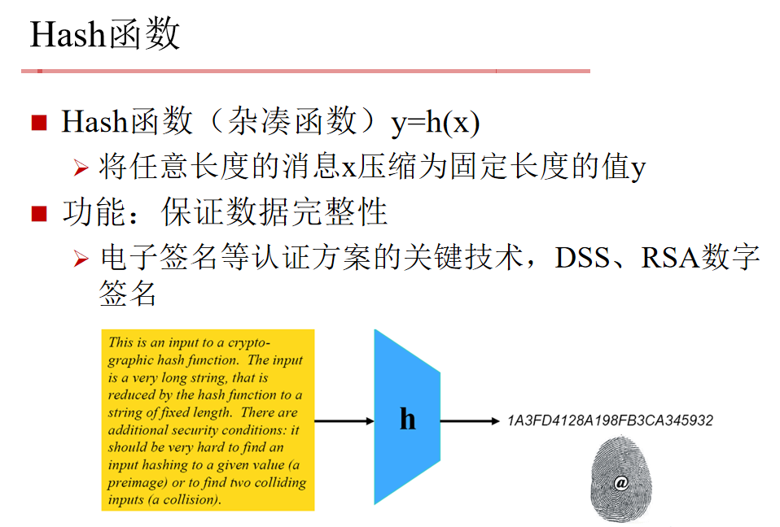

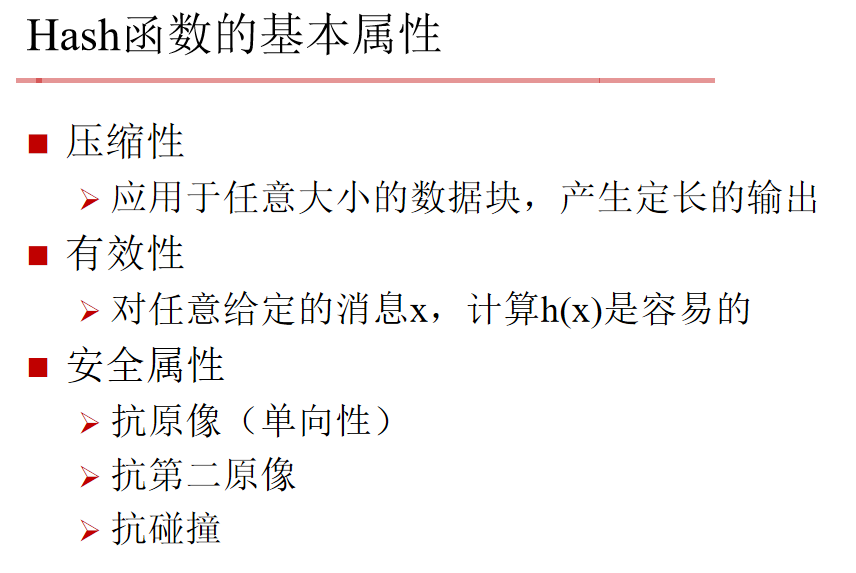

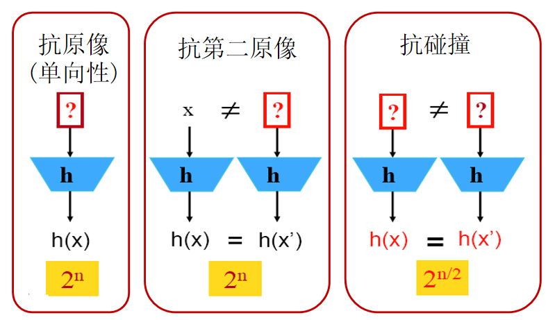

### Starknet中的哈希函数

#### sn_keccak


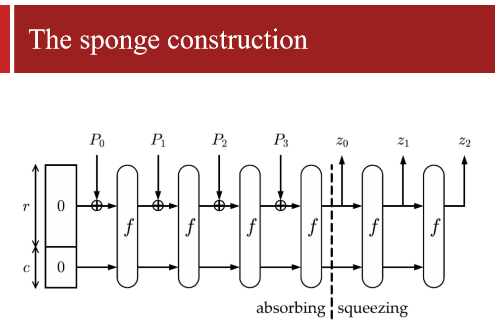

The first 250 bits of the Keccak256 hash (this is just Keccak256 augmented in order to fit into a field element).

#### **Pedersen hash**

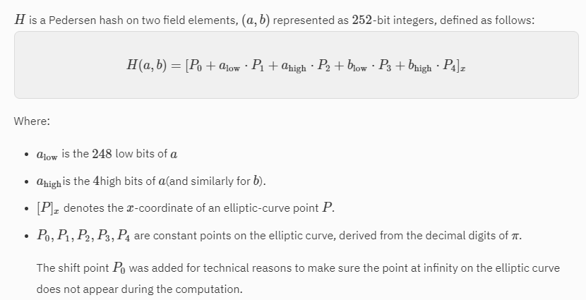

```Plain
P0=(2089986280348253421170679821480865132823066470938446095505822317253594081284,
1713931329540660377023406109199410414810705867260802078187082345529207694986)

P1=(996781205833008774514500082376783249102396023663454813447423147977397232763, 
1668503676786377725805489344771023921079126552019160156920634619255970485781) 

P2=(2251563274489750535117886426533222435294046428347329203627021249169616184184,
1798716007562728905295480679789526322175868328062420237419143593021674992973) 

P3=(2138414695194151160943305727036575959195309218611738193261179310511854807447,
113410276730064486255102093846540133784865286929052426931474106396135072156) 

P4=(2379962749567351885752724891227938183011949129833673362440656643086021394946,
776496453633298175483985398648758586525933812536653089401905292063708816422)
```


**用途**

- Block Hash

  - 

  - ```Plain
    ℎ(𝐵) = ℎ(
        block_number,
        global_state_root,
        sequencer_address,
        block_timestamp,
        transaction_count,
        transaction_commitment,
        event_count,
        event_commitment,
        0,
        0,
        parent_block_hash
    )
    ```

- tx_hash

  - ```SQL
    deploy_tx_hash = ℎ(
        "deploy",
        version,
        contract_address,
        sn_keccak("constructor"),
        ℎ(constructor_calldata),
        0,
        chain_id
    )
    ```

- MPT树

#### **Poseidon hash**

[Poseidon](https://www.poseidon-hash.info/)是一系列哈希函数，其设计目的是作为代数电路非常高效。因此，它们在 ZK 证明系统（例如 STARK 等）中非常友好。

Poseidon函数是一种基于HADES permutation构建的海绵结构的哈希函数。

关于HADES permutation可以参考以下论文：

[On a Generalization of Substitution-Permutation Networks: The HADES Design Strategy (Updated Version)](https://eprint.iacr.org/2019/1107.pdf)

定义如下：


用途：

- declare_v2_tx_hash 

  - ```SQL
    declare_v2_tx_hash = ℎ(
        "declare",
        version,
        sender_address,
        0,
        h(class_hash),
        max_fee,
        chain_id,
        nonce,
        compiled_class_hash
    )
    ```

- state_commitment 

## 零知识证明

**零知识证明(zero-knowledge proof)，简写为 ZKP**，最初由 S.Goldwasser、S.Micali 及 C.Rackoff 在 1985 年的论文《交互证明系统的知识复杂性》提出，**指的是证明者能够在不向验证者提供任何有用信息的情况下，使验证者相信某个论断是正确的。**

**性质**

- 完备性：只要论断是正确的，证明者就可以让验证者相信论断。即：真的假不了。
- 合理性：如果论断是错误的，那么作弊的证明者无法让验证者相信论断。即：假的真不了。
- 零知识性：协议的交互仅仅揭露论断正确与否，而没有泄露任何其他的信息。

**零知识证明有何应用？**

- 证明关于隐私数据的声明
  - 在不暴露账户余额的情况下证明某人的账户余额多于一个亿，FTX。
  - 在不暴露DNA数据的情况下匹配DNA
- 匿名认证
  - 在不揭露身份的情况下证明请求者具有访问某些资源的权限
  - 证明某个人隶属于某个身份组而不暴露是哪个
- 匿名支付
  - 纳税而不透露收入
- 外包计算
  - 以太坊扩容技术ZK-Rollup就可以理解为一种外包计算，将计算过程放到链下进行，将结果放到链上去验证

### ZK-Stark

**A proof system is a zk-STARK if it satisfies:**

- zk: zero knowledge, private inputs are shielded
- Scalable: **proofs** for CI of computation lasting T cycles are 
  - generated in roughly T cycles (quasi-linear in T), *and*
  - verified exponentially faster than T (roughly log T cycles)
- Transparent: verifier messages are random coins; no trusted setup
- ARgument of Knowledge: proof can be generated only by party *knowing* private input (formally: an efficient procedure can *extract* the secrets from a prover)

#### ZK-Stark vs ZK-Snark

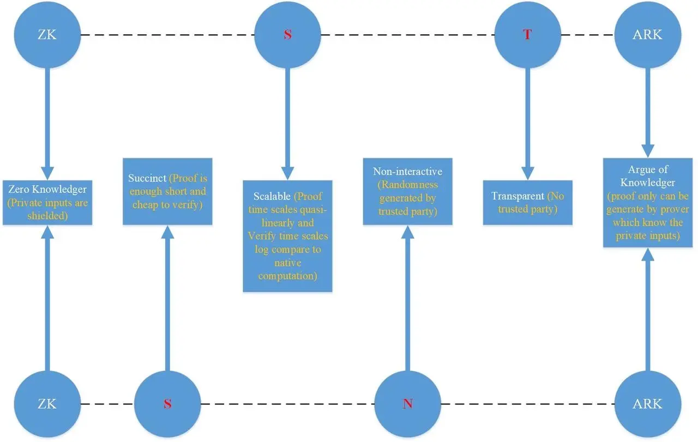

- 相同点
  - 都实现了将隐私的输入可靠隐藏；
  - 都是基于知识论证，不知道private input的prover生成不了有效的proof；
  - 都可以实现交互式与非交互式的算法，只是取决于randomness是由谁来生成的；
- 不同点
  - zk-stark具有可扩展性，即证明和验证的耗时与原始计算的耗时分别呈拟线性关系（且线性因子为常量）和对数关系，这意味这，如果原始输入的数据集增大1000000倍，zk-stark的证明耗时增加线性倍数的时间，但验证时间仅仅增加21*log1000000 =~ 420倍。证明耗时呈线性关系基本满足所有的ZKP算法，但是验证时间呈对数关系，仅此一家，因此在扩展性上，zk-stark要胜一筹。
    1. 在扩展性方面，STARK 的扩展性更强。证明生成速度具备线性扩展性，验证时间和证明大小具备对数扩展性。**但缺点在于生成的证明尺寸更大。但随着证明规模增加，验证成本将会边际递减——这意味证明越大，总成本越低。**
  - zk-stark同样具有简洁性，但是是验证简洁性。所谓简洁性，通常是指即使验证程序很大，生成的proof size也不会很大，同时又能很快的完成验证（比native computation快很多）。相比对zk-snark，zk-stark的proof size要大的多，因此在简洁性上，zk-snark要胜一筹。
  - zk-stark有更简单的密码学假设，避免了对椭圆曲线、配对和指数知识假设的需要，纯粹依赖哈希和信息论，因此抗量子攻击。总体来讲 STARK 比 SNARK 更安全。

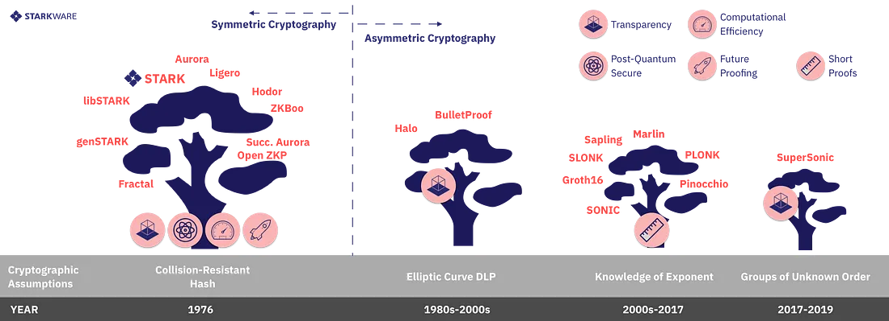

#### 扩展性详解

**证明时间线性扩展：证明人花费的时间与哈希调用的数量呈近似线性关系。**

在 80 比特的安全级，STARK 每 12288 次哈希调用的证明者执行时间为 1 秒，得 12288次/S；而每 98304 次哈希调用需要 10 秒，得 9830次/S，因此，我们可以知道 STARK 的证明时间和哈希调用基本呈近似线性关系。如下图所示。


https://eprint.iacr.org/2021/582.pdf

**验证时间和证明大小对数扩展：验证时间（与证明大小）与哈希调用呈现对数关系。**如下图所示：


左图可以看出，当哈希调用从 3072 增加到 49152，验证时间从 40 毫秒增加到 60 毫秒。而当哈希调用从 49152 增加到 786432，验证时间仅从 60 毫秒增加到 80 毫秒。证明大小同理。**因此，我们可得知，哈希调用次数越多，平均验证时间越短，平均证明大小也会更小（调用哈希生成哈希值/证明）。**

数据来源：[ethSTARK Documentation – Version 1.2](https://eprint.iacr.org/2021/582.pdf) 

#### 递归证明

在理解递归证明的所有优势之前，需先了解当前SHARP采用的非递归证明方案：

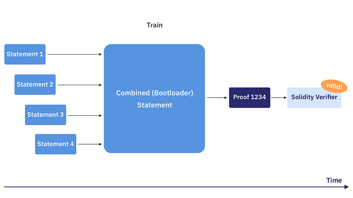

随着statement到来，当达到某特定容量（或某时间）阈值，会生成一个大的combined statement（又名Train）。仅当收到所有独立statement之后，才会为combined statement生成证明。生成证明的时间将很长（约为 为每个statement独立生成证明的时间之和）。

为特别大的statement生成证明将受限于可用的计算资源，如内存。在递归证明方案之前，这为限制STARK证明扩容的主要瓶颈。

在STARK方案中，证明某statement用时与执行该statement用时约成线性关系。如证明用时为T。验证该证明用时约为log(T) ，这通常称为“对数压缩”。换句话说，验证某statement证明的用时要远低于直接计算该statement用时。

Cairo用于表示通用计算statement，可由Prover用于生成STARK证明，也可由Verifier用于验证STARK证明。

递归证明的点在于：

- 可编写某Cairo程序，来证明数千笔交易的正确性
- 再编写另一Cairo程序，来验证多个STARK证明
- 然后为多个“up-stream” 证明的有效性 生成单个证明。

由于对数压缩和约为线性的证明时间，为验证某STARK证明生成证明用时将相对较短。

当实现了递归证明之后，当statement到来，无需等待，SHARP即可开始为其生成证明，这些证明将以多种模式不断合并为递归证明，直到某个点，最终的证明将提交到链上verifier contract：

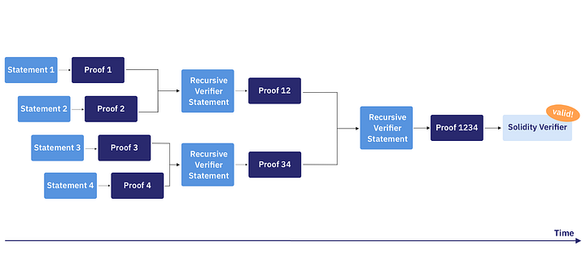

如上图中，（可能源自4个不同来源的）4个statement发送给SHARP：

- 这些statement可并行证明
- 然后每组proof经Recursive Verifier statement（为某验证STARK proof的Cairo程序）验证后，合并生成为一个证明。Recursive Verifier statement可确保其所验证的2个证明是正确的。
- 证明再进一步由Recursive Verifier statement合并生成一个证明。该单个证明可确保4个原始statement的正确性，该证明将最终提交上链，由某Solidity verifier合约验证。

**递归证明的好处**

递归证明的好处有：

1. 降低链上开销：可将多个证明压缩为单个，意味着链上验证单笔交易的开销将降低（每个statement可包含多笔交易）。
2. 降低延迟：递归证明模式的延迟低于为large Train statement生成证明的延迟，主要有2方面原因：
   1. 输入的statement可并行证明（而不是为单个巨大的combined statement生成证明）
   2. 无需等待Train中最后一个statement到达才开始生成证明。proof可与新到达的证明一起进行结合。

# StarkEx：专有 ZKR 引擎

StarkEx 是一款 Layer2 扩展引擎，为 dApp 提供技术服务，可以将数十万笔交易“rollup”成一个 80 KB 的证明 —— 远远小于智能手机照片的大小。

不同于其他 rollups 大多通过运营节点来盈利，通过定制化的扩容服务获取头部客户是 Starkware 在发展路径上的一个特色。可能团队认为在发展初期，健康的现金流和明确的客户反馈更重要。也因为 Starkware 所采用的技术路线和语言在一开始很难让开发者上手，所以定制化服务对客户更友好，dYdX、ImmutableX 等客户的扩容方案代码都是 StarkWare 团队帮忙写的。

## 数据

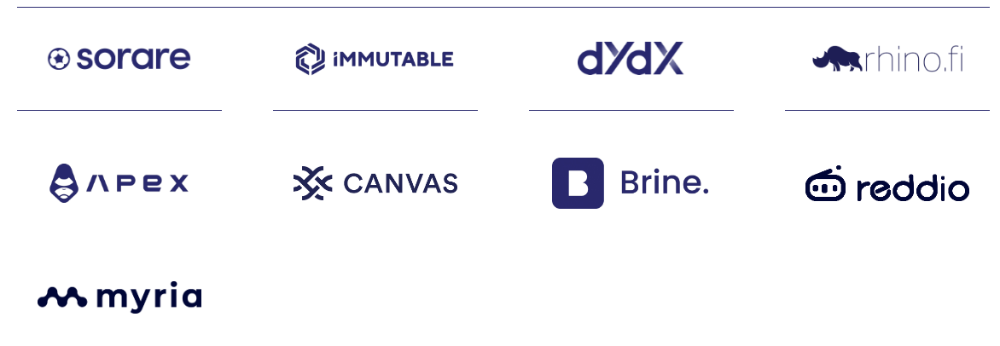


## 整体架构

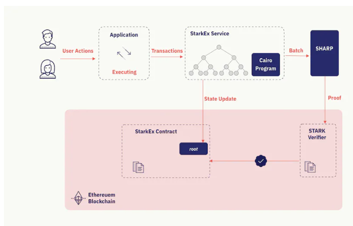

组成部分：

• Application：面向C端用户的独立应用，定义了应用层面的逻辑，用来接收用户端的链下交易，并把交易发送给 StarkEx。例如 dydx、Immutable 应用。

• StarkEx Service：面向B端应用的定制化服务引擎。用来执行一个批量的交易，并更新批量交易的状态。一旦链上 Stark Verifier 合约验证完这笔批量交易的合法性后，StarkEx 会把新的确认状态发送上链到 StarkEx 合约中。状态由 Merkle 树来表示，每一个叶子结点都表示一个独立的交易，这颗 Merkle 树的树根 root 就表示这批量交易的最终状态，root 哈希一旦被记录上链，就完成了整批交易的确认。

• Shared Prover (SHARP) ：一个通用型的 zk Stark 证明生成系统。可同时接收来自多个应用的批量请求，并生成这些请求的 zk Stark 证明，然后提交上链。

• Stark Verfier：零知识证明中的验证者。这里是一个链上验证合约，用来验证外部接收的零知识证明的合法性。

• StarkEx 合约：有两个用途。一方面，满足用户的充值和提款代币的需求，使得在任何情况下，用户都有权限进行资金管理（例如dydx中的出入金操作）。另一方面，在 Stark Verifier 确认交易的合法性后，更新链上的状态（记录新的 Merkle 树根哈希），以确认交易最终完成。

流程：

1. 应用中所有的用户交易都会被发往StarkEx服务并在链下计算执行。
2. StarkEx批量执行交易并“打包”，将“打包”后的交易发送给SHARP系统；SHARP系统会计算出一个证明（用来证明这笔批量交易的合法性）。
3. SHARP会将生成好的 zk Stark Proof 发送给链上的 Stark verifier 合约进行校验。
4. 校验通过后会通知 StarkEx 合约，同时 StarkEx 服务会将执行后的确认状态 calldata 发送给 StarkEx 合约。如果 Proof校验通过，状态才会被在链上确认，这才最终完成了批量交易。

用户端的交互：

1. On-chain transaction: 与 StarkEx 合约（L1）直接进行交互，例如dydx进行现货交易的充值操作。
2. Off-chain transaction: 充值确认后，用户所有的交易都在链下执行，交易被用户的 StarkKey 签名后，发往 StarkEx 进行下一步执行计算。

## **StarkEx合约架构**


​     StarkEx 合约实现了去中心化的用户自托管资产，例如对于去中心化交易所的实现，StarkEx 合约允许用户在任何情况下能够有效的充值或提款。另外，StarkEx 合约也保存了每次从链下提交的合法的状态（以 Merkle树哈希的形式保存）。 **组成部分：**

- Proxy Contract（代理合约）：托管了所有用户资产，并且保存了所有确认状态。实现最简化的逻辑，具体通过下面的调度合约实现功能逻辑。
- Dispatcher Contract（调度合约）：实现了 StarkEx 的业务功能逻辑。由于合约的大小在以太坊中被限制不超过24kb，为了实现完整的逻辑，又被分为若干个子合约，每个实现特定的功能，并通过 delegate call 的方式触发。
- Sub-Contracts（子合约）：每个子合约实现了 StarkEx 合约的特定的功能逻辑，他们通过delegate call的形式在proxy的上下文中执行。
- Verifier Fact Registry: 用来对接应用合约与Verifier Contract的合约。它执行了 fact registry API，并且将应用合约的fact的格式转换成了Verifier Contract的使用格式。Fact Registry（事件注册）具体的生成过程为：在链下 StarkEx 系统中运行 CAIRO 合约，输入批量交易，生成 execution trace，然后通过 SHARP 模块生成 zk Stark Proof，将其提交上链验证；验证后生成一个 fact，将 fact 发送给注册合约进行注册，以供后续的 Dapp 合约能够通过接口验证这个事实已经被合理注册（例如 Alice给Bob转移了1000DAI这个事实行为）。
  - Fact Registry Contract:一种合约设计模式，目的：将statement验证和依赖statement有效性的应用分离。
  - Statement: 断言P(x, witness) = True or False
    - x就是Fact，witness表示表示一些辅助信息。
    - 例子：
      - isComposite(x, witness) 当且仅当 x 是合数时返回 True。witness是 x 的一个因子。
      - merkleLeaf((leaf, root), witness) 当且仅当 leaf 是具有根节点 root 的 Merkle 树中的叶子节点时返回 True。witness是Merkle树中叶子节点到根节点的路径。
      - signedText((text, public_key), witness) 当且仅当文本 text 出现在由 public_key 签名的某个文档中时返回 True。witness是包含文本及其签名的文档。
  - Fact Registry Contract包含的方法
    - Add(fact, witness)：将fact添加到集合中，前提是语句成立。
    - IsValid()：仅当fact在集合中的时候返回True。
  - 流程：
    - 在第一阶段，fact和相应的witness传递给注册表合约，它验证有效性并将事实添加到集合中。
    - 在第二阶段，当调用应用程序合约时，它调用注册表合约来检查fact的有效性。
  - 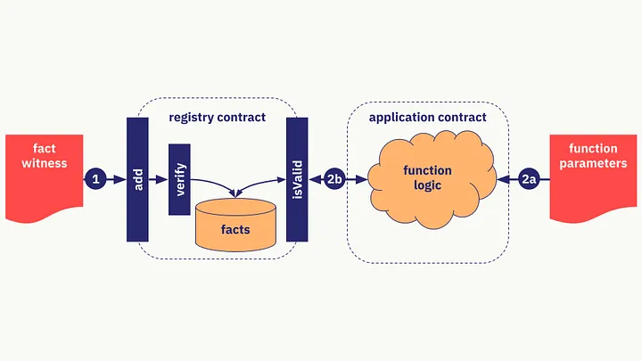
  - Trade Off
    -   使用注册表合约会增加一些存储和通信的开销，当验证语句的总成本（计算和 calldata）较低时，使用注册表合约可能会增加不可忽略的 gas 成本开销，在这种情况下，我们直接将验证过程放在应用合约中更好。然而，当验证的成本较高时，这些开销变得微不足道，并且使用所提议的设计模式有许多优点：
    - 应用程序合约和注册表合约之间的清晰分离，包括能够升级其中一个而不更改另一个的能力；
    - 将 gas 成本分摊给不同的参与方。当一个参与方应支付用于验证语句的 gas 成本，而另一个参与方应支付用于引用验证的事实的应用程序合约的 gas 成本时，这是很有用的。
    - 多次重用Fact（即缓存）；
    - 规模经济：通过使用 STARK、SNARK 或 BulletProofs 等简洁证明系统，可以使用比单独验证每个事实所需的总 gas 数量少得多的 gas 验证一批事实。因此，依赖于相同语句的不同合约可以从大规模的经济效益中受益。
- Committee Fact Registry: 自定义链下状态记录能被强制转换成链上状态记录，这里就用到了 Committee 注册表（例如，交易所的交易确认数据储存在链下，需要依赖可信任的第三方机构如Infura、Coinbase组成的 Committee 委员会共同授权，才能把状态迁移到链上确认）。
- Escape Verifier Fact Registry: 用于满足用户资金自托管的需求。例如，一旦应用方的服务遭到了冻结或者宕机，用户可以通过预设定好机制证明 Proxy 合约内资产的所有权，然后自主提出资产。

## **StarkEx后端架构**

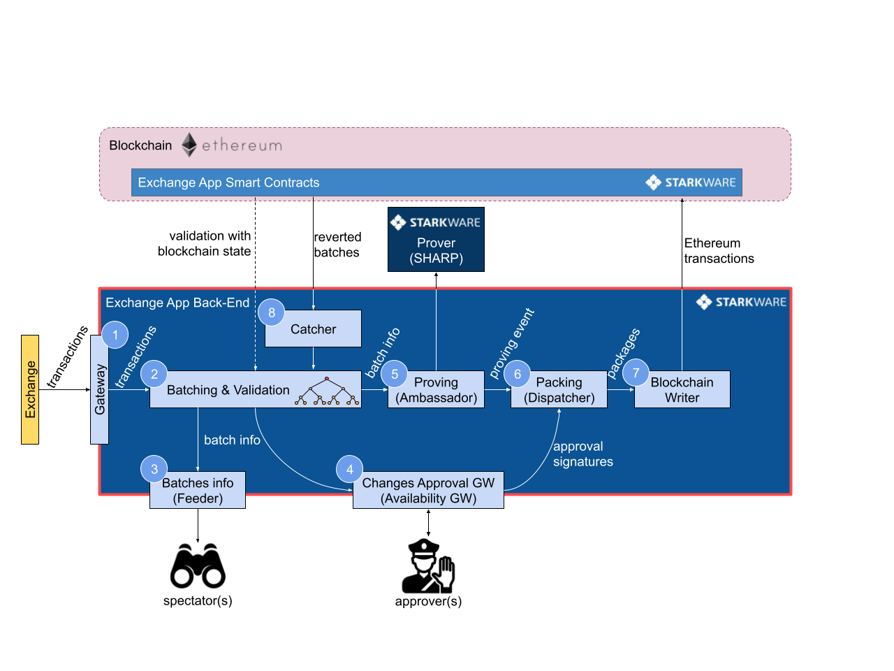

- Gateway网关：接收来自应用方的交易，并且把交易排序到队列中。
- Batching & Validation：批量发送交易并验证：负责一个batch一个batch的批量发送交易，并且保证每个子交易的合法性（例如，同时检查链下和链上状态，用户的余额是否充足）。每个batch的状态依赖前一个batch的执行情况，如果前一个batch执行失败例如链上回滚，那么后面batch的执行依赖再前一个batch的执行状态（例如下图中的batch4，原本应该在batch3之后执行，但是batch3执行失败，使得batch4自动接在batch2后面执行）。

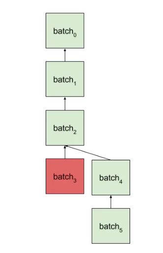

- Batches Info (Feeder)：一个外部监视器，用来监听batch中的交易数据。
- Change Approval Gateway：为了保持 StareWare 后端保存的数据和应用（例如dydx交易所）数据的一致性，同时为了保证链下数据可用性。采用了第三方 approver 进行对batch交易数据进行签名的方式，来保证batch数据的有效性。
- Proving (Ambassador)：负责对 batch 数据生成零知识证明。
- Packing (Dispatcher)：负责发送“打包的”数据给主链。“打包的”数据包括接收交易的地址以及 calldata。打包的数据以此形成数据队列，队列的排序就是链上执行的顺序。
- Blockchain Writer：进一步将上面“打包的”数据进行打包，这一步会包含发交易的必要数据，比如 gas price、nonce、signature等。然后通过标准交易发送给链上合约执行。
- Catcher：一个监听器，用来监听链上事件，将回滚的 batch 通知给 batcher。

## **StarkEx项目集成技术架构**

 任何合作项目方集成 StarkEx 服务，可以参考下面的架构图（去中心化交易所的架构图dydx为例）。StarkEx 能接收合作方后端发来的交易，使用 zk rollup 批量提交上链，提高交易TPS，减少每笔交易的手续费，提升用户体验。


**组成部分：**

1. 前端：由项目方开发提供，直接面向用户。能够支持两种操作：链上操作和链下操作。链上操作为常规的给以太坊发送交易的操作，例如用户通过metamask钱包签名交易发送资产到 StarkEx 指定合约进行存款操作，这就要求前端需要集成合约的ABI，以及适配 StarkEx 支持的钱包。链下操作为一种特殊的操作，通常需要前端额外适配 StarkEx 的加密签名算法库，以适配 StarkEx 链下引擎适配的签名格式。签名后的交易会从项目方的后端发送到 StarkEx 后端执行后续操作。
2. 交易验证器 Order Verification：用户通过前端发送给后端的交易需要先被验证一遍（例如确保签名、用户余额等信息无误），然后再提交上链。对于一些操作的确认例如充值操作，这笔交易的最终需要通常等待几个区块才能确认交易的有效性，确认无误后，才完成了充值验证过程。
3. 业务逻辑 Business Logic：这部分来完成项目的业务逻辑（例如dydx的订单撮合）。所有有效的撮合交易将会从项目方后端发送给 StarkEx 服务。撮合后，用户的新资产信息状态会被更新到 Account State中进行链下存储。
4. 交易队列：所有发送给 StarkEx 的交易都要放在一个交易队列中，且队列中的每笔交易都有一个独立的索引值 tx_id；StarkEx 收到所有交易后，会根据这个 tx_id 来顺序化的执行交易。如果一个交易队列中的索引值有缺失，为了安全起见，StarkEx 会等待缺失值填满后才进行批量交易打包。
5. 交易发送者 TX Sender：负责将交易队列发送给 StarkEx 服务中的 Gateway组建，执行后续上链操作。
6. 错误处理 Error Handler：一般情况下，项目方后端会检查每笔交易的有效性（在 Order Verification中），所以发送给 Gateway 的交易队列都是有效的。但是会存在一些极端情况例如以太坊区块回滚导致的用户充值交易失败。这就要求 StarkEx 后端服务中也会检查一次交易是否有效。一旦检查出某笔交易失效，就会将交易情况发送给项目方接口并接收到项目方返回的新交易数据来替换错误的交易数据（例如，空的交易队列）。
7. 状态批准 State Approval：为了保证项目方后端的交易数据与 StarkEx 的一致性，且为了保证项目方有最大的掌控权限，在每笔批量交易数据上链前，项目方后端都会进行一步状态确认的操作。具体的来讲，项目方此时充当approver的角色，对 StarkEx 发过来的 batch 数据进行比对然后签名批准。批准后才会通过 StarkEx 进行下一步生成 zk Stark Proof 并进行最终的上链。
8. 抗审查机制：去中心化交易所为了实现用户资产的自托管以及资金安全，建立了抗审查机制。在特殊情况下（例如监管冻结、黑客攻击、严重bug等），允许用户生成特殊的 zk Stark Proof，直接与合约交互，强制从 StarkEx 合约资金池中提出属于用户自己的资产。

总之，从本质上来讲，使用 StarkEx 服务构建的项目（以dydx交易所为例），并不是把每笔交易放在链上计算、存储、执行，而是把每笔交易的状态和每笔交易计算过程的可行性证明（zk Stark proof）批量打包上链，最终在链上记录确认的状态（Merkel Tree Root）。而这中间所有的计算过程、中间状态、用户资产余额等放在了链下项目方自己的服务器里面执行。这样做的弊端显然是用户体验不如中心化交易所：TPS低、撮合系统不够高效、确认交易需要的时间长（一般每个batch的StarkEx交易需要5分钟才能完成链上确认）。那为什么不像中心化交易所一样，将所有的信息放在链下，而还要折腾一圈儿之后把计算后的状态证明提交上链呢？因为这里能够满足自托管的需求，相对于中心化交易所，其优势在于：资金安全（所有资金放在L1合约中，只能通过提交有效的 zk Stark Proof 才能提款）、抗审查（充值和提款可以与合约交互完成，不依赖链下服务器）、数据透明（所有资金池内的资产数量在链上可查，防止交易所作恶）。

# StarkNet：通用 ZKR 

https://book.starknet.io/ch03-02-sequencers.html

https://book.starknet.io/chapter_3/index.html

优先看下面的

## 简介

不同于为不同的应用定制 ZK Rollup 的 StarkEx，StarkNet是一个通用的ZK Rollup，开发者可在 StarkNet 上部署应用。

## 组成部分

StarkNet网络中主要有三个组成部分：

-  Prover（证明者），
- Sequencer（排序器）
- Node（节点）；

同时，还有部署在L1以太坊上的验证者合约（Verifier，验证zk-Stark Proof）和核心状态合约（StarkNet Core）。

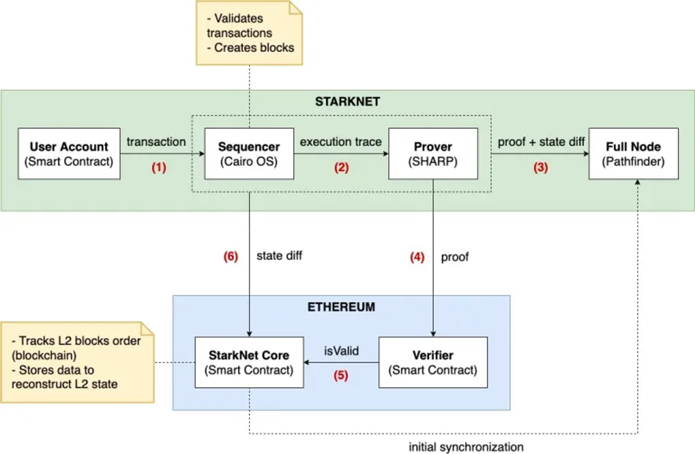

https://david-barreto.com/starknets-architecture-review/

### Sequencer

StarkNet 作为一个 Rollups， 没有类似过往我们认识的矿工角色存在，但依旧需要一个角色来 「验证交易」、「决定交易顺序」、「构建区块」，而负责这三者工作内容的人就是 Sequencer。

Sequencer 是一个 off-chain server，工作流程的第一步是接收用户送上来的交易（数笔来自不同用户的不同交易），之后 Sequencer 会决定交易顺序并且构建 L2 的区块。

Sequencer 需要确认交易是被帐户拥有者授权的（由于 StarkNet 使用了原生 AA 的帐户系统，因此这里不一定是单纯确认签名正确，有可能是多签或其他验证逻辑）。接着通过 StarkNet OS 执行一次交易，概念上就像 EVM 一样，接收 input 后执行合约逻辑并产出 output。

Sequencer 执行过交易之后会生产出一个 trace（需要注意这个 trace 不是 function return 而是一个执行过程的见证），并将这些执行内容的过程见证送去给 Prover 让其生产证明。

目前正在开发Rust版本的Sequencer来提高性能。

### Prover&Verifier

Prover 同样也是一个Off-Chain Server，这个角色主要就是接收Sequencer执行完交易产生的trace，并且生产出相对应的STARK proofs，然后交给在L1 上的Verifier Contract 验证，验证通过之后会注册fact供未来的L1 StarkNet Core Contract 进行查询。

补充说明：目前 StarkNet 中只有一个 Prover，不仅为 StarkNet 生成证明，还为运行在 StarkWare 自己的 StarkEx rollup 上的所有其他应用程序（例如 Immutable X、dYdX、Sorare 等）生成证明。这就是为什么该服务被称为 Shared Prover 或 SHARP 的原因。

### L1 Core Contract

StarkNet L1 Core Contract 储存着 L2 上状态们的证明，大家常常说 Rollups 的安全性是由 Ethereum 这个 L1 保证的就是来自于此。当我们的 trace 经过 Prover 产生 proof 并且在 L1 Verifier Contract 验证之后，就会告诉 L1 Core Contract 这个「状态更新」是正确无误的。

「状态更新」指的是在 StarkNet 执行交易之后会改变状态，而我们要想办法正确地传达给 L1 Core Contract 说 L2 上的状态从 S 更新成 S’ 了。

当 L1 Core Contract 透过 Verifier 知晓了此次的状态更新是合法后，Sequencer 就会在合约中更新 State Root。

换句话说，知道「这次状态更新是合法」的意思是，我们透过 ZKP 证明了链下的运算是真的被正确执行了，而不是瞎掰出来一个随便的交易结果就叫 L1 Core Contract 更新状态。

此外如果 StarkNet 在 L1 有一些 operations 需要定义，也会定义在 StarkNet L1 Core Contract 中，例如：

1. 官方认可的 Verifiers Contract（Addresses List）
2. L1 ↔ L2 互动的逻辑（讯息传递的方式）

**StarkNet vs Hermez**

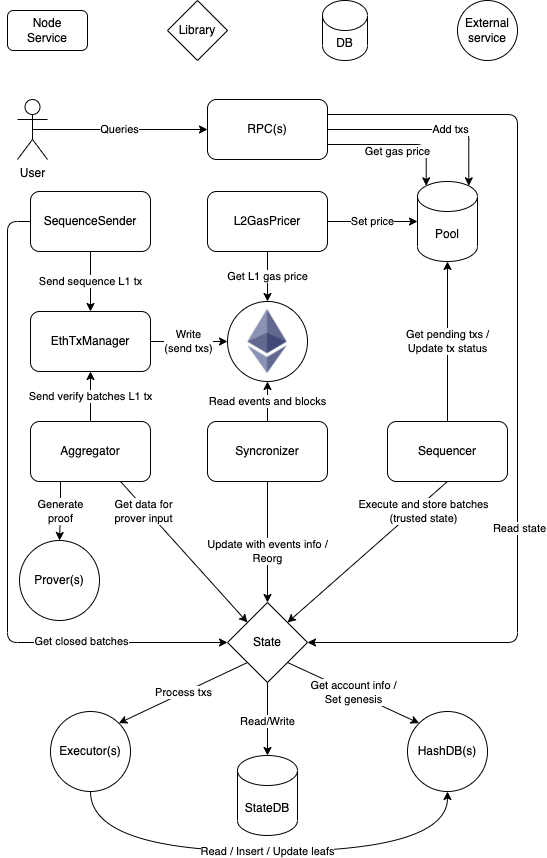

## 交易生命周期


## EVM 兼容

ZK-Rollup早期为人诟病的地方是不能兼容 EVM，不能支持智能合约功能，例如早期 Gitcoin 捐赠主要支付途径的 zkSync 1.0 仅能支持转账等基本功能。同时，由于不同 ZK 应用有各种专用电路，无法相互调用，可组合性差。因此市场急需能够支持以太坊智能合约的ZK-Rollup，而其中关键门槛就是能够支持零知识证明的虚拟机。随着引入 EVM 兼容的 zkVM，zk-rollups 才开始支持以太坊 dApps。


 Credit:Zhangye@scroll

**Comparison**

由于 ZK-EVM 并没有统一的设计标准，所以每个项目方基于不同角度在兼容 EVM 和支持 ZK 之间权衡设计出各自方案，目前基本分为两种思路：

1. 编程语言层面支持，自定义 EVM 操作码，把 ZK-friendly 的操作抽出来重新设计新的、架构不同的虚拟机，通过编译器将 Soilidity 编译成新的虚拟机操作码
2. 字节码层面支持，支持原生 EVM 操作码

对于第一种策略，由于不受原有 EVM 指令集的约束，可以更灵活的将代码编译成对零知识证明更友好的指令集，同时也摆脱了兼容所有 EVM 原有指令集所需要的艰巨而繁重的工作。

对于第二种策略，由于完全支持了 EVM 现有的指令集，其使用的是和 EVM 一样的编译器，因此天然就对现有的生态系统和开发工具完全兼容，同时还更好的继承了以太坊的安全模型。

第一种思路更灵活，工作量更小，但需要花费额外精力在适配上；第二种思路工作量相对来说会大一些，但是兼容性更好，安全性更高。

**Starkware zkEVM**

Starkware 的 ZK-Rollup 通用解决方案 StarkNet 可以运行任意的以太坊 dApp。开发者可以通过编译器将 Solidity 编译成 StarkNet 的智能合约语言 Cairo，再部署到其 ZK-friendly 的 VM。

**zkSync zkEVM**

类似 Starkware，zkSync 2.0 通过开发编译器前端 Yul 和 Zinc 来实现 ZK-EVM 功能。Yul 是一种中间 Solidity 表示，可以编译为不同后端的字节码。Zinc 是用于智能合约和通用零知识证明电路的基于 Rust 的语言。它们都是基于开源框架 LLVM，能够实现最高效的 ZK-EVM 字节码。

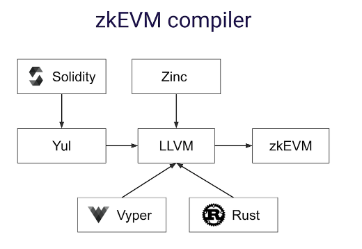

https://miro.medium.com/max/1400/0*S3TKmlfGRTx5MNkE

与 StarkNet 一样，zkSync zkEVM 在语言层面实现了 EVM 的兼容性，而不是在字节码层面。

**Polygon zkEVM**

Polygon Hermez 是一个具有 zkVM 的 Polygon zk-rollup，旨在支持 EVM 的兼容性。为此，EVM 字节码被编译成 「微操作码（micro opcodes）」 并在 uVM 中执行，uVM 使用 SNARK 证明和 STARK 证明来验证程序执行的正确性。

**Scroll zkEVM**

Scroll 是一个EVM等效的zk-Rollup，可以实现与以太坊字节码级别的兼容性，也就是说，所有的EVM操作码和基础层完全相同。Scroll 团队计划为每个 EVM 操作码设计零知识电路。

https://github.com/privacy-scaling-explorations/zkevm-circuits

["Scroll design, architecture, and challenges" (Ye Zhang, Scroll)](https://www.youtube.com/watch?v=1bVe77-yfBA&t=1s)

**Which is better?**


https://vitalik.ca/general/2022/08/04/zkevm.html

在 Vitalik 的博文里，他将 ZK-EVM 分为几种类型。其中，类型 1 是直接在以太坊上面直接开发 ZK-EVM，这个开发过于复杂而且目前效率太低，以太坊基金正在研究中。类型 2、类型 2.5 和类型 3 是 EVM 等效的 ZK-EVM，Scroll 和 Polygon Hermez 目前处于类型 3 这个阶段，朝着类型 2.5 乃至类型 2 努力。类型 4 是高级语言兼容的 ZK-EVM，包括 Starkware 和 zkSync。这些类型并无好坏之分，而且 ZK-EVM 也没有统一的标准。

**从理论上讲，以太坊不需要为 L1 使用单一的 ZK-EVM 实现进行标准化；不同的客户可以使用不同的证明，因此我们继续从代码冗余中受益。**— Vitalik Buterin

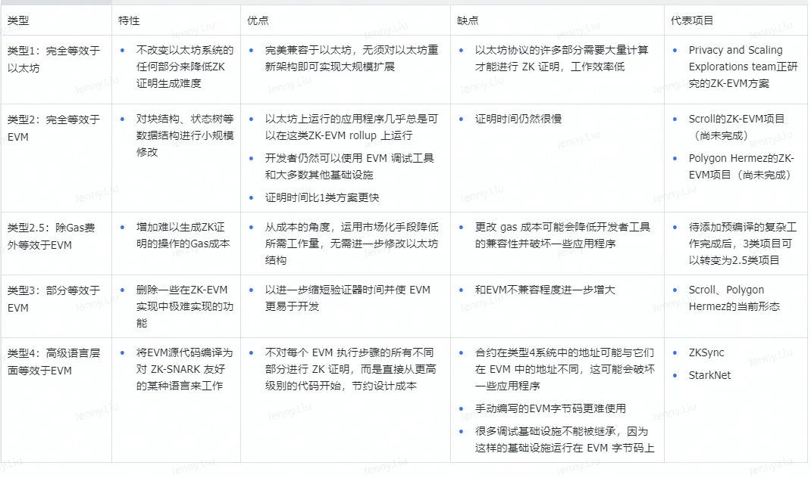

**StarkNet 网络本身不兼容 EVM，而设计了另外一套 ZK 友好的 Cairo VM。**

StarkNet 没有和 Hermez 和 Scroll 一样针对以太坊操作码做 ZK 电路，而是自己做了一套更加 ZK 友好的汇编语言、AIR（代数中间表示） 以及高级语言 Cairo。

StarkNet 属于 Vitalik 定义的 type 4 级别——语言兼容的 zkEVM（StarkNet由于定制了虚拟机严格来讲属于zkVM）。

**尽管 StarkNet 本身不兼容 EVM，但 StarkNet 仍然可以通过其他方式兼容以太坊。**

1、[Warp](https://github.com/NethermindEth/warp)：将 Solidity 转译为 Cairo 语言的转译器

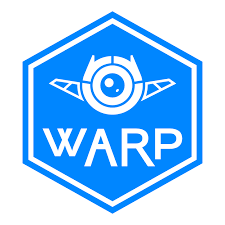

Warp 是一个 Solidity-Cairo 转译器，目前已经由以太坊著名基础设施团队 [Nethermind](https://twitter.com/nethermindeth) 开发完成。Warp 可以把 Solidity 代码转译为 Cairo，但转译后的 Cairo 程序往往需要修改并增添 Cairo 特性（如调用内置函数，优化内存等）才能最大化执行效率。

2、[Kakarot](https://twitter.com/KakarotZkEvm)：一个用 Cairo 语言编写的 zkEVM


Kakarot 是一个用 Cairo 写的智能合约，目前部署在 Starknet（goerli测试网）上，字节码等效 EVM。目前处于测试阶段。以太坊应用可以通过部署到 Kakarot 的方式移植到 StarkNet。

- ✅Kakarot 可以：(a) 执行任意 EVM 字节码，(b) 按原样部署 EVM 智能合约，(c) 调用 Kakarot 部署的 EVM 智能合约的功能（视图和写入方法）。
- ✅Kakarot 是一个 EVM 字节码解释器。

目前已经支持 EVM 全部操作码。

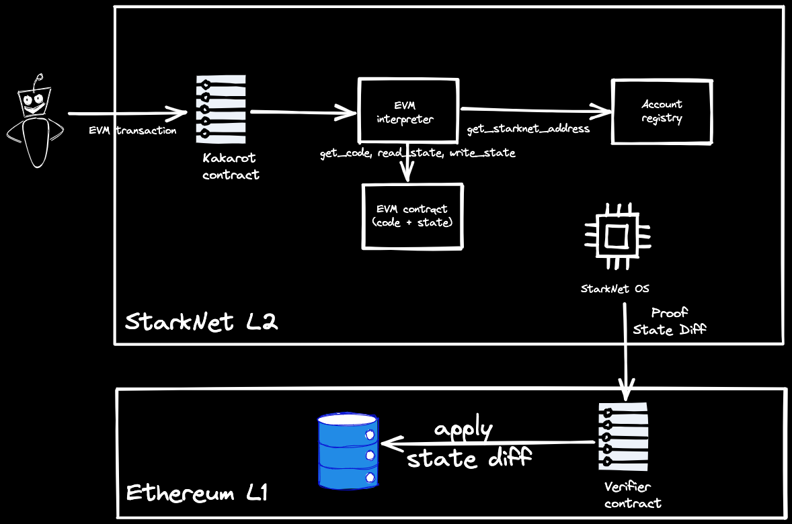

https://github.com/sayajin-labs/kakarot

## CairoVM

为通用计算程序创建有效性证明，需要深入了解 STARKs 背后的复杂数学原理。对于每项计算，构建一个代数中间层表示（AIR）至关重要，它包含了一组多项式约束，能够准确地描述给定的计算。Cairo 最初被称为 「CPU AIR」，是一个虚拟 CPU 和一个单一的 AIR，能够用相同的「通用」 AIR 描述任何计算。Cairo VM 专门为有效性证明系统量身定制，并不受 EVM （以太坊虚拟机）所施加的限制所约束。

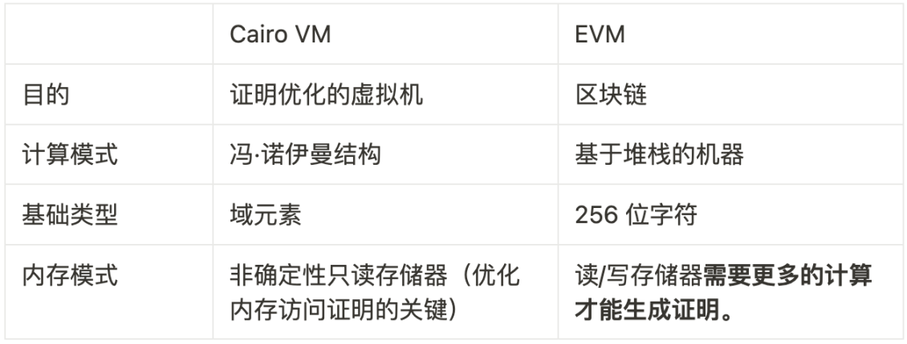

### CASM

CASM（Cairo 汇编）是 Cairo VM 运行的机器代码。CASM 被转译为多项式约束，强制程序正确执行。CASM 是生态系统的关键组件，因为无论用户向 Starknet 排序器发送什么，被证明的都是 CASM 的正确执行。

### Cairo Zero，一项突破

2020 年发布的 Cairo Zero 引入了世界上首个用于创建 STARK 可证明程序的图灵完备语言，彻底改变了可验证的计算方式。Cairo Zero 程序在本地编译为 CASM，然后发送到 Starknet 排序器。尽管 Cairo Zero 具有开创性，但由于 Cairo Zero 的低层级性质，它的学习曲线较为陡峭，并没有完全抽象出证明程序执行所需的底层加密原语。

### Cairo：比 Cairo Zero 更强大

Cairo（现为 v2.1.1 版本）突破了 Cairo Zero 的局限性，有望实现更安全、更高效的合约编写。Cairo 采用类 Rust 的语法，并抽象出了 Cairo Zero 中存在的限制（例如，只写一次的内存），大大改善了开发者的体验。

Cairo 引入了 Rust 世界的现代编程概念，如特征 / 实现、泛型、枚举匹配等，同时无需牺牲底层 CairoVM 带来的证明生成效率。

### Sierra

随着 Cairo 的出现，Sierra 也随之而来。Sierra 充当了 Cairo 和 CASM 之间的中间层表示的角色。这个附加层确保用户代码在所有情况下都是可证明的。Sierra 编译为 「安全 CASM」，这是 CASM 的一个子集，可保证所有输入都是可证明的。这个在用户代码和可证明代码之间的中间层至关重要，它可以保护 Starknet 排序器免受因不可证明交易形式出现的 DOS 攻击。

Sierra 的一个令人意外的好处是，由于这种简单的中间层表示的存在，Starknet 的排序器最终可以直接在本地硬件上运行，而无需通过 CairoVM。为了说明执行 Sierra 的排序器的强大功能，请看以下示例：人们可以使用 Sierra 的类型信息来处理本地类型（例如 u32），而无需在 CairoVM 的质数域字段中进行处理。